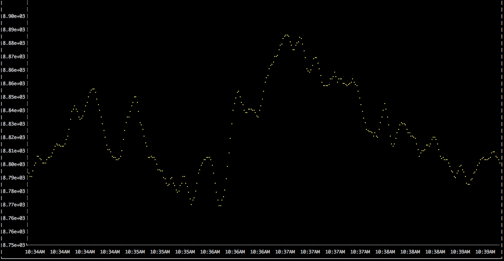

# Golang Wavefront Client

Go libraries and a command line tool for interacting with Wavefront

## Libraries 

### Client

The Client is used to interact with the Wavefront API.

Example:
```Go
package main

import (
  "github.com/spaceapegames/go-wavefront/api"
)

func main() {

  config := &wavefront.Config{
    Address: "metrics.wavefront.com",
    Token: "123456-7890-9876-2728728-xxx",
  }
  client, err := wavefront.NewClient(config)
  if err != nil {
    panic(err)
  }
  client.Debug(true)
```

Debug mode will dump HTTP request objects to screen before executing.

### Querying

The Querying function is used to make queries against the Wavefront charts API

Example:
```Go
      // NewQuery returns a Querying object with some sensible defaults applied
      // (End time is Now, start time is one hour ago, strict mode is True)
      query := client.Query.NewQuery(`sum(ts("system.cpu-1.user", host="myhost.example.com"))`)
      // Optionally a map of parameters can be provided             
      params := wavefront.QueryParams{"p" : "200" } //set maximum number of points returned
      query := client.Query.NewQuery(`sum(ts("system.cpu-1.user", host="myhost.example.com"))`, params)
      // SetParams sets parameters on a Querying object, given a map of parameters
      params["g"] = "s" //set granularity to seconds
      query.SetParams(params) 

      // SetStartTime sets the time from which the query will begin
      // It defaults to one hour ago
      query.SetStartTime(wavefront.LAST_3_HOURS)

      // SetEndTime does similarly, but takes an actual time.Time object
      // It defaults to Now
      query.SetEndTime(time.Now().Add(-20 * time.Minute))

      // Execute runs the query and returns a QueryResponse object
      q, err := query.Execute()

```

#### Alerts

The Alerts function is used to retrieve alert information.

Example:
```Go
      // Retrieve all currently Active (firing) alerts with the customerTag 'Games'
      params := &wavefront.QueryParams{ "customerTag": "Games" }
      alerts, err := client.Alerts.All(params)
      if err != nil {
            panic(err)
      }

      for _, a := range alerts {
            fmt.Printf("%s %s\n", a.Name, a.Severity)
      }
```

#### Events

The Events function is used to create and delete Wavefront events.

Example:
```Go
      event := client.Events.NewEvent("My Event")
      event.AddAffectedHost("myhost.example.com")

      // Create an instantaneous event 
      if rawResp, err := event.Instant(); err != nil {
        panic(err)
      }

      // Start an Event
      if rawResp, err := event.Create(); err != nil {
        panic(err)
      }
      time.Sleep(30 * time.Second)
      // End the event
      if rawResp, err := event.End(); err != nil {
        panic(err)
      }
```

### Writer

The Writer object is somewhat different in that it provides an interface around writing metrics to a Wavefront Proxy agent.

Metrics can be added with `AddMetric` and then flushed with `WriteMetrics`. Alternatively using `Write` will write a single metric straight through.

Example:

```Go
package main

import (
       "github.com/spaceapegames/go-wavefront/writer"
       "time" 
)

func main() {
        wavefrontHost := "localhost"
        wavefrontPort := 2878
        w, err := wavefront.NewWriter(wavefrontHost, wavefrontPort)
        if err != nil {
                panic(err)
        } 
        // Add Metrics to the Writer object
        w.AddMetric(&wavefront.Metric{Name: "tcp-server.request.count", Value: "1"})
        // Optionally override the Timestamp
        w.AddMetric(&wavefront.Metric{Name: "tcp-server.request.error", Value: "1", Timestamp: time.Now().Unix()})
        // Flush metrics to Wavefront
        w.WriteMetrics()
        w.Close()
}
```

## Command Line Tool

The CLI can be used to poke and pull the Wavefront API endpoints.

It will require a `WAVEFRONT_TOKEN` and `WAVEFRONT_ADDRESS`, which can be set either as environment variables or passed with the `--token` and `--wavefront-address` flags.

```
CLI Tool for accessing Wavefront API
Ensure that Wavefront token and address are passed, either through the WAVEFRONT_TOKEN and WAVEFRONT_ADDRESS environment variables, or the command line.

Usage:
  wavefront [command]

Available Commands:
  alerts      Retrieve Wavefront Alerts
  events      Create Wavefront Events
  query       Query Wavefront

Flags:
  -d, --debug                      show HTTP request information
  -j, --raw                        show raw JSON response
  -t, --token string               Wavefront access token
  -w, --wavefront-address string   Wavefront API address. e.g. example.wavefront.com

Use "wavefront [command] --help" for more information about a command.
```

As a useless gimmick, the CLI can plot a live graph in the terminal:

```bash
wavefront query 'sum(last(1m,interpolate(ts("server.connections", tag="preprod"))))' --live-graph --granularity s --period 1h
```



## Contributing

Pull requests are welcomed. 

If you'd like to contribute to this project, please raise an issue and indicate that you'd like to take on the work prior to submitting a pull request. 


